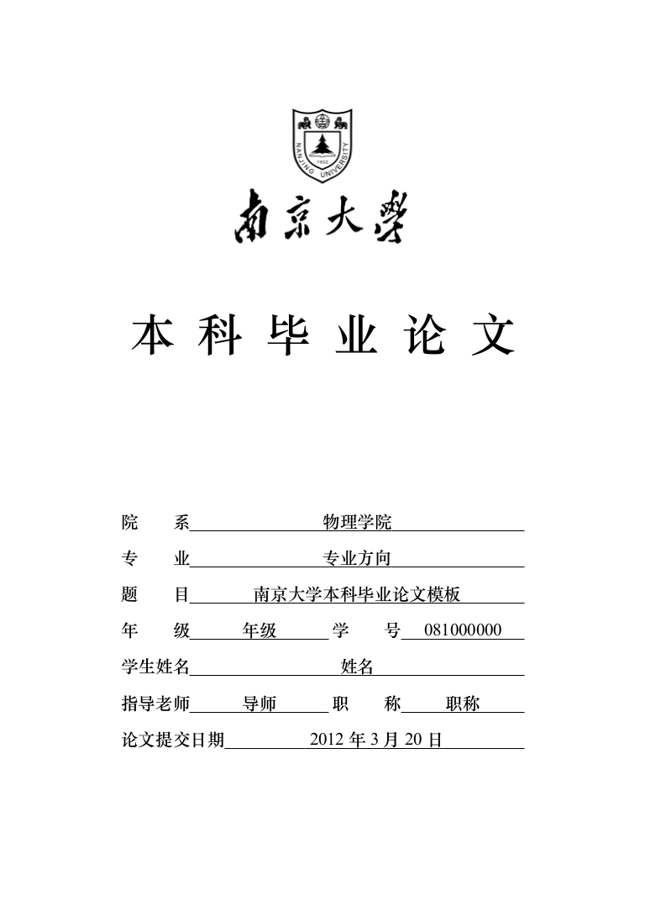

NJUThesis
=========

这是南京大学本科毕业论文 LaTeX 模板。

简单说明
--------
 - Ubuntu 10.04
 - TeX Live 2010
 - 推荐编辑器： Texmaker 或者 TeXstudio。

对于 Linux 用户，有一份 `Makefile` 帮助自动生成包含参考文献的最终 PDF。如果不采用 `make` 的方式，需要进行如下步骤的编译：

	xelatex main
	xelatex main
	bibtex main
	xelatex main

封面粗体采用华文中宋而不是默认宋体加粗，那样效果太难看了。

在 `data/name.tex` 文件中填写相关的信息，包括中英文姓名、年级、标题、院系等等。

在 `data/abstract.tex` 中填写中英文摘要及关键词。

论文正文分章存放在 `data/chap0X.tex` 中，在 `main.tex` 中相应位置插入 `\include{data/chap0X}`，注意不要带 `.tex` 后缀。

TODO
-------
 - 写一份详细的使用说明。
 - 制作文档类。

Screenshot:

